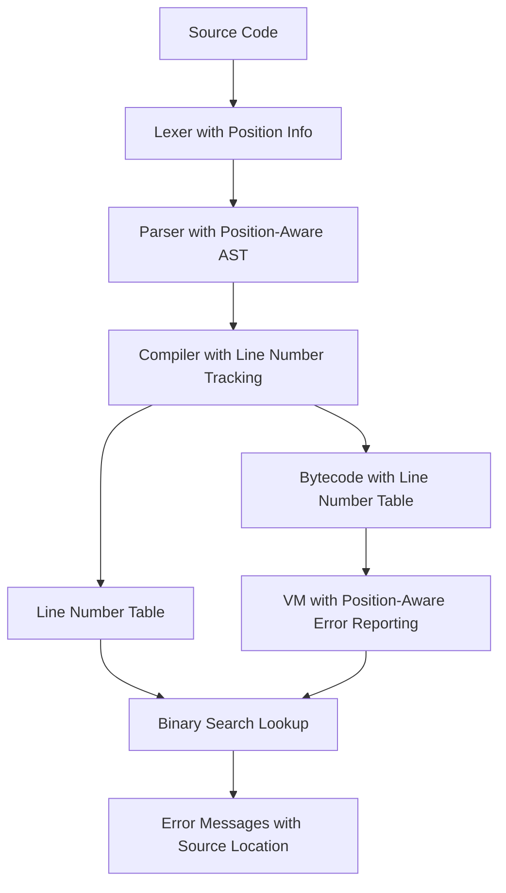

# Design Document

## Overview

本设计文档描述了为mini-scheme编译器添加行号表功能的技术架构。行号表系统将在三个层面工作：AST层面保留源代码位置信息，编译器层面建立字节码偏移量与源代码行号的映射，虚拟机层面提供快速的位置查询功能。

该设计遵循增量式实现原则，最小化对现有代码的影响，同时提供高效的位置信息查询能力。

## Architecture

### 系统架构概览



### 核心组件关系

1. **SourcePosition**: 统一的位置信息结构
2. **PositionAwareAST**: 带位置信息的AST节点
3. **LineNumberTable**: 字节码偏移量到源代码行号的映射表
4. **PositionTracker**: 编译时位置信息追踪器
5. **ErrorReporter**: 位置感知的错误报告器

## Components and Interfaces

### 1. SourcePosition 结构

```rust
/// 源代码位置信息
#[derive(Debug, Clone, PartialEq, Eq)]
pub struct SourcePosition {
    /// 起始行号 (1-based)
    pub start_line: usize,
    /// 起始列号 (1-based)  
    pub start_column: usize,
    /// 结束行号 (1-based)
    pub end_line: usize,
    /// 结束列号 (1-based)
    pub end_column: usize,
    /// 在源代码中的字节偏移量范围
    pub span: (usize, usize),
}

impl SourcePosition {
    /// 创建新的位置信息
    pub fn new(start_line: usize, start_column: usize, end_line: usize, end_column: usize, span: (usize, usize)) -> Self;
    
    /// 从TokenInfo创建位置信息
    pub fn from_token(token: &TokenInfo) -> Self;
    
    /// 合并两个位置信息（用于跨越多个token的AST节点）
    pub fn merge(&self, other: &SourcePosition) -> Self;
    
    /// 检查位置是否有效
    pub fn is_valid(&self) -> bool;
    
    /// 获取位置的字符串表示
    pub fn to_string(&self) -> String;
}
```

### 2. 增强的AST节点

```rust
/// 带位置信息的表达式
#[derive(Debug, PartialEq, Clone)]
pub struct PositionedExpr {
    pub expr: Expr,
    pub position: Option<SourcePosition>,
}

impl PositionedExpr {
    /// 创建带位置信息的表达式
    pub fn new(expr: Expr, position: SourcePosition) -> Self;
    
    /// 创建不带位置信息的表达式（用于生成的代码）
    pub fn without_position(expr: Expr) -> Self;
    
    /// 获取表达式的位置信息
    pub fn position(&self) -> Option<&SourcePosition>;
    
    /// 获取表达式的起始行号
    pub fn start_line(&self) -> Option<usize>;
}
```

### 3. LineNumberTable 结构

```rust
/// 行号表条目
#[derive(Debug, Clone, PartialEq, Eq)]
pub struct LineNumberEntry {
    /// 字节码偏移量
    pub bytecode_offset: usize,
    /// 对应的源代码行号
    pub line_number: usize,
    /// 可选的列号信息
    pub column_number: Option<usize>,
}

/// 行号表
#[derive(Debug, Clone)]
pub struct LineNumberTable {
    /// 行号条目列表，按字节码偏移量排序
    entries: Vec<LineNumberEntry>,
    /// 源文件名（可选）
    source_file: Option<String>,
}

impl LineNumberTable {
    /// 创建新的行号表
    pub fn new() -> Self;
    
    /// 添加行号条目
    pub fn add_entry(&mut self, bytecode_offset: usize, line_number: usize, column_number: Option<usize>);
    
    /// 根据字节码偏移量查找行号（二分查找）
    pub fn lookup_line(&self, bytecode_offset: usize) -> Option<usize>;
    
    /// 根据字节码偏移量查找完整位置信息
    pub fn lookup_position(&self, bytecode_offset: usize) -> Option<&LineNumberEntry>;
    
    /// 获取所有条目的迭代器
    pub fn entries(&self) -> impl Iterator<Item = &LineNumberEntry>;
    
    /// 检查表是否为空
    pub fn is_empty(&self) -> bool;
    
    /// 获取条目数量
    pub fn len(&self) -> usize;
    
    /// 设置源文件名
    pub fn set_source_file(&mut self, filename: String);
    
    /// 获取源文件名
    pub fn source_file(&self) -> Option<&str>;
}
```

### 4. 增强的Chunk结构

```rust
impl Chunk {
    /// 行号表
    pub line_number_table: LineNumberTable,
    
    /// 写入指令时同时记录位置信息
    pub fn write_instruction_with_position(&mut self, opcode: OpCode, position: &SourcePosition);
    
    /// 写入带操作数的指令时记录位置信息
    pub fn write_instruction_with_byte_and_position(&mut self, opcode: OpCode, operand: u8, position: &SourcePosition);
    
    /// 根据字节码偏移量获取源代码位置
    pub fn get_source_position(&self, offset: usize) -> Option<usize>;
    
    /// 获取行号表的引用
    pub fn line_number_table(&self) -> &LineNumberTable;
}
```

### 5. PositionTracker 编译时追踪器

```rust
/// 编译时位置信息追踪器
pub struct PositionTracker {
    /// 当前正在编译的AST节点位置
    current_position: Option<SourcePosition>,
    /// 上一次记录的行号
    last_recorded_line: Option<usize>,
    /// 当前字节码偏移量
    current_bytecode_offset: usize,
}

impl PositionTracker {
    /// 创建新的位置追踪器
    pub fn new() -> Self;
    
    /// 设置当前正在编译的AST节点位置
    pub fn set_current_position(&mut self, position: Option<SourcePosition>);
    
    /// 获取当前位置信息
    pub fn current_position(&self) -> Option<&SourcePosition>;
    
    /// 检查是否需要记录新的行号条目
    pub fn should_record_line(&self, line: usize) -> bool;
    
    /// 记录新的行号条目
    pub fn record_line(&mut self, line: usize);
    
    /// 更新字节码偏移量
    pub fn update_bytecode_offset(&mut self, offset: usize);
}
```

### 6. 增强的Compiler结构

```rust
impl Compiler {
    /// 位置追踪器
    position_tracker: PositionTracker,
    
    /// 编译带位置信息的表达式
    pub fn compile_positioned_expr(&mut self, expr: &PositionedExpr) -> Result<(), CompileError>;
    
    /// 发射指令时记录位置信息
    fn emit_instruction_with_position(&mut self, opcode: OpCode, position: Option<&SourcePosition>);
    
    /// 发射带操作数的指令时记录位置信息
    fn emit_instruction_with_byte_and_position(&mut self, opcode: OpCode, operand: u8, position: Option<&SourcePosition>);
    
    /// 获取当前编译位置
    fn current_compile_position(&self) -> Option<&SourcePosition>;
}
```

### 7. ErrorReporter 错误报告器

```rust
/// 位置感知的错误报告器
pub struct ErrorReporter {
    /// 源代码内容（用于显示上下文）
    source_code: Option<String>,
    /// 源文件名
    source_file: Option<String>,
}

impl ErrorReporter {
    /// 创建新的错误报告器
    pub fn new() -> Self;
    
    /// 设置源代码内容
    pub fn set_source_code(&mut self, source: String);
    
    /// 设置源文件名
    pub fn set_source_file(&mut self, filename: String);
    
    /// 格式化运行时错误消息
    pub fn format_runtime_error(&self, error: &RuntimeError, bytecode_offset: usize, line_table: &LineNumberTable) -> String;
    
    /// 格式化编译错误消息
    pub fn format_compile_error(&self, error: &CompileError, position: Option<&SourcePosition>) -> String;
    
    /// 显示源代码上下文
    pub fn show_source_context(&self, line: usize, column: Option<usize>) -> String;
}
```

## Data Models

### 位置信息数据流

1. **Lexer阶段**: TokenInfo已包含line, column, span信息
2. **Parser阶段**: 将TokenInfo的位置信息转换为SourcePosition，附加到AST节点
3. **Compiler阶段**: 从AST节点提取位置信息，在生成字节码时记录到LineNumberTable
4. **Runtime阶段**: VM使用LineNumberTable将字节码偏移量映射回源代码位置

### 内存布局优化

```rust
/// 紧凑的行号表条目（内存优化版本）
#[derive(Debug, Clone, Copy)]
pub struct CompactLineNumberEntry {
    /// 字节码偏移量（24位，支持16MB字节码）
    pub bytecode_offset: u32, // 实际使用低24位
    /// 行号（24位，支持16M行）
    pub line_number: u32,     // 实际使用低24位
}

impl CompactLineNumberEntry {
    /// 创建紧凑条目
    pub fn new(bytecode_offset: usize, line_number: usize) -> Option<Self>;
    
    /// 获取字节码偏移量
    pub fn bytecode_offset(&self) -> usize;
    
    /// 获取行号
    pub fn line_number(&self) -> usize;
}
```

## Error Handling

### 错误类型扩展

```rust
/// 扩展的编译错误类型
#[derive(Debug, Clone)]
pub enum CompileError {
    // 现有错误类型...
    
    /// 位置信息相关错误
    InvalidPosition {
        message: String,
        position: Option<SourcePosition>,
    },
    
    /// 行号表溢出
    LineNumberTableOverflow {
        max_entries: usize,
    },
}

/// 扩展的运行时错误类型
#[derive(Debug, Clone)]
pub enum RuntimeError {
    // 现有错误类型...
    
    /// 带位置信息的运行时错误
    RuntimeErrorWithPosition {
        error: Box<RuntimeError>,
        bytecode_offset: usize,
        source_position: Option<SourcePosition>,
    },
}
```

### 错误恢复策略

1. **位置信息缺失**: 使用最近可用的位置信息或提供"位置未知"的提示
2. **行号表损坏**: 回退到基本的字节码偏移量报告
3. **内存不足**: 使用紧凑格式或采样记录关键位置

## Testing Strategy

### 单元测试

1. **SourcePosition测试**
   - 位置信息创建和合并
   - 边界条件处理
   - 格式化输出

2. **LineNumberTable测试**
   - 条目添加和查找
   - 二分查找算法正确性
   - 边界条件和空表处理

3. **PositionTracker测试**
   - 位置追踪逻辑
   - 重复行号过滤
   - 字节码偏移量同步

### 集成测试

1. **端到端位置追踪**
   - 从源代码到错误报告的完整流程
   - 复杂嵌套表达式的位置信息
   - 多文件编译的位置信息

2. **性能测试**
   - 大文件编译时的内存使用
   - 行号查找的时间复杂度
   - 编译时间影响评估

### 测试用例示例

```scheme
;; 测试用例：嵌套表达式的位置信息
(define (factorial n)
  (if (= n 0)
      1
      (* n (factorial (- n 1)))))

;; 预期：每个子表达式都应该有准确的位置信息
;; 错误应该指向具体的表达式位置
```

## Performance Considerations

### 内存使用优化

1. **条目压缩**: 使用紧凑的数据结构减少内存占用
2. **采样记录**: 对于大文件，可以采样记录关键位置而非每行都记录
3. **延迟构建**: 只在需要时构建完整的行号表

### 查找性能优化

1. **二分查找**: O(log n)时间复杂度的位置查找
2. **缓存机制**: 缓存最近查找的结果
3. **预计算**: 预计算常用的位置映射

### 编译时性能

1. **增量更新**: 只在行号变化时更新行号表
2. **批量操作**: 批量添加行号条目减少重复工作
3. **内存池**: 使用内存池减少分配开销

## Integration Points

### 与现有追踪系统集成

```rust
/// 扩展的编译追踪信息
impl CompilationTrace {
    /// 添加位置信息到追踪
    pub fn add_position_info(&mut self, position: &SourcePosition);
    
    /// 获取追踪的位置信息
    pub fn position_info(&self) -> Option<&SourcePosition>;
}

/// 扩展的执行追踪信息
impl ExecutionTrace {
    /// 添加源代码位置信息
    pub fn add_source_position(&mut self, position: Option<&SourcePosition>);
    
    /// 获取当前指令的源代码位置
    pub fn source_position(&self) -> Option<&SourcePosition>;
}
```

### 与反汇编器集成

```rust
impl Disassembler {
    /// 反汇编时显示源代码行号
    pub fn disassemble_with_source_lines(&self, chunk: &Chunk, show_source: bool);
    
    /// 获取指令的源代码位置字符串
    pub fn get_source_location_string(&self, chunk: &Chunk, offset: usize) -> String;
}
```

### 与REPL集成

```rust
/// REPL中的位置感知错误报告
impl REPL {
    /// 显示带源代码上下文的错误
    pub fn show_error_with_context(&self, error: &RuntimeError, source: &str);
    
    /// 高亮显示错误位置
    pub fn highlight_error_position(&self, source: &str, position: &SourcePosition);
}
```

## Migration Strategy

### 阶段1: 基础设施
- 实现SourcePosition和LineNumberTable结构
- 扩展AST节点支持位置信息
- 更新Parser生成带位置信息的AST

### 阶段2: 编译器集成
- 在Compiler中添加PositionTracker
- 修改字节码生成过程记录位置信息
- 更新Chunk结构支持行号表

### 阶段3: 运行时集成
- 在VM中添加位置查找功能
- 扩展错误报告包含位置信息
- 集成ErrorReporter

### 阶段4: 工具集成
- 更新反汇编器显示源代码位置
- 集成追踪系统
- 优化性能和内存使用

### 向后兼容性

1. **可选位置信息**: 所有位置信息都是可选的，不影响现有功能
2. **渐进式启用**: 可以逐步启用不同组件的位置信息支持
3. **回退机制**: 在位置信息不可用时提供合理的默认行为